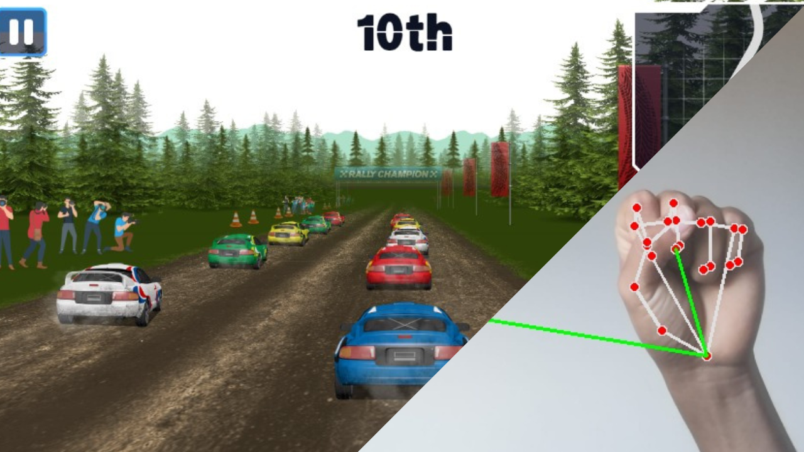
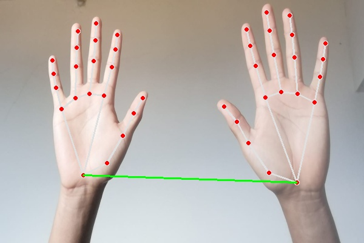
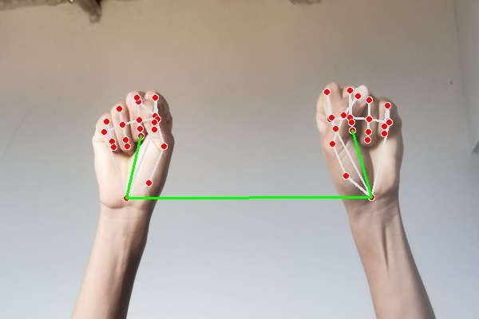
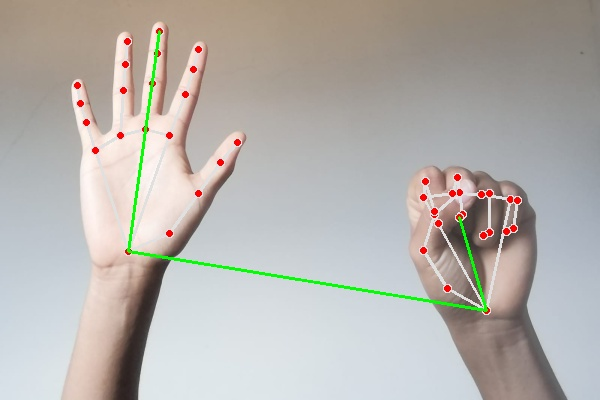
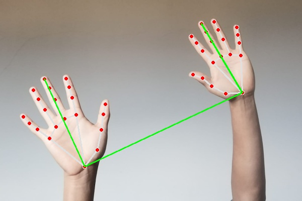
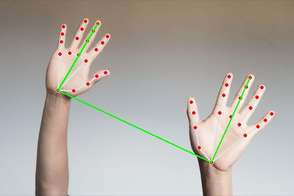
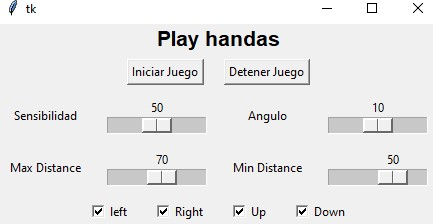

# HandPlayController

## Descripción

Este proyecto de visión artificial basada en una aplicación de escritorio desarrollada en Python utilizando las biblioteca Tkinter OpenCv y Mediapipe,  permitiendo así activar y desactivar el reconocimiento de manos para controlar las pulsaciones de las teclas de izquierda, derecha, arriba y abajo. Está diseñada específicamente para controlar un juego de carreras.

## Movimientos
1. Parar --> No presiona **ninguna** tecla

2. Arriba --> Presiona la tecla **up**

3. Abajo --> Presiona la tecla **down**

4. Izquierda --> Presiona la tecla **left**
   

5. Derecha --> Presiona la tecla **right**
   

## Características

- Activación y desactivación del reconocimiento de manos.
- Control de las teclas de izquierda, derecha, arriba y abajo mediante gestos de mano.
- Interfaz gráfica intuitiva y fácil de usar.

## Interfaz Gráfica

## Instalación

**1.** Clona este repositorio:

    git clone https://github.com/Valen89hh/HandPlayController.git

**2.** Navega hasta el directorio del proyecto:

    cd HandPlayController

**3.** Crea un entorno virtual:

    python -m virtualenv venv

**4.** Activa el entorno virtual:

    - En Windows --> venv\Scripts\activate

    - En macOS y Linux --> source venv/bin/activate

**5.** Instala las dependencias requeridas:

    pip install -r requirements.txt

**6.** Ejecuta la aplicación:

    python app.py

## Prueba el Juego

Puedes probar el juego en línea [aquí](https://www.juegos.com/juego/rally-champion).

## Contribuciones

Las contribuciones son bienvenidas. Si tienes sugerencias, mejoras o correcciones de errores, por favor, crea un "issue" o envía una solicitud de extracción.
